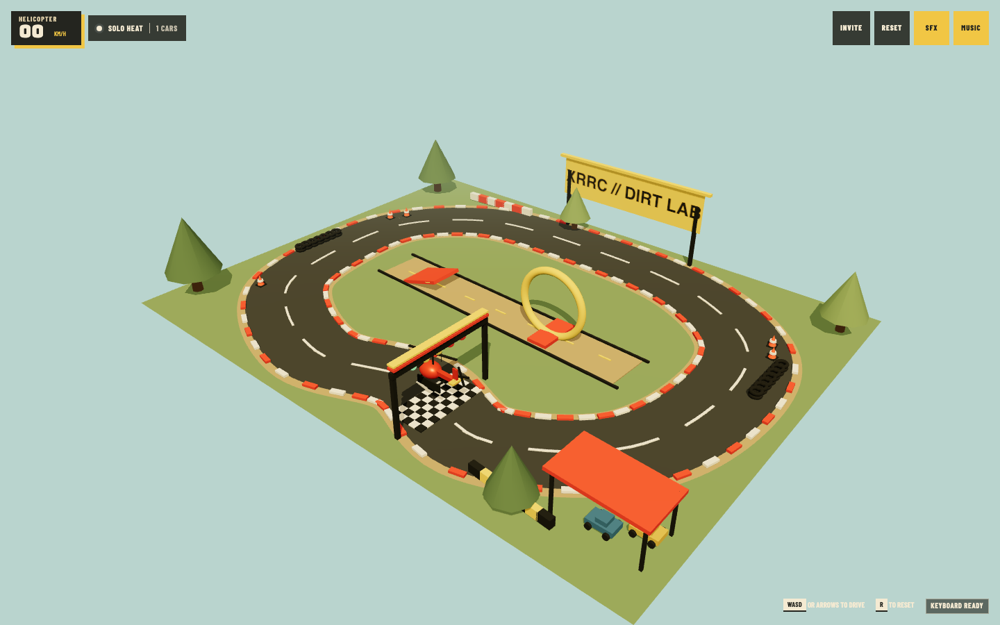
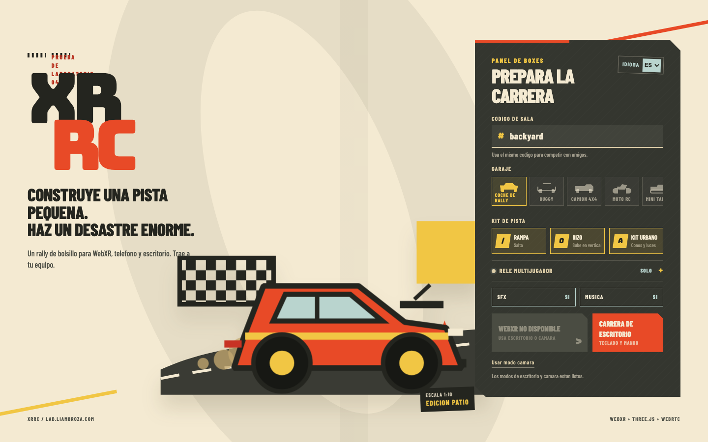
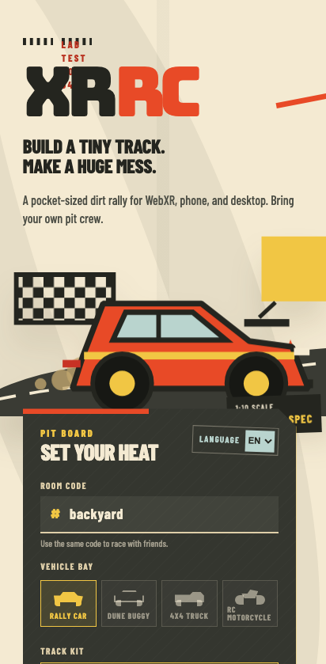
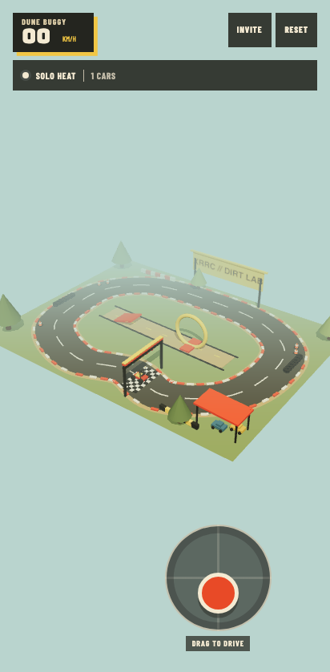
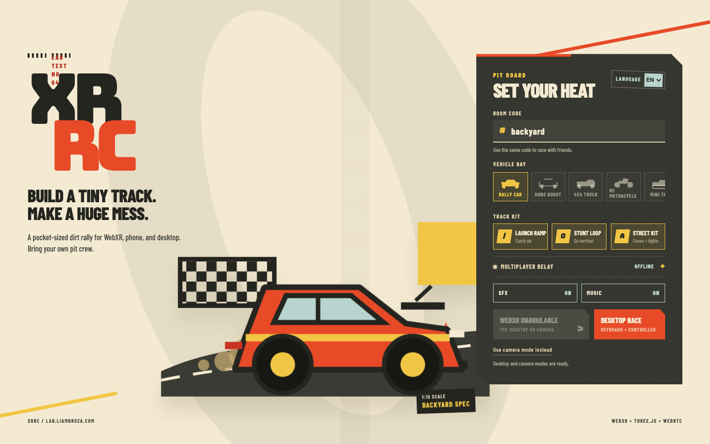
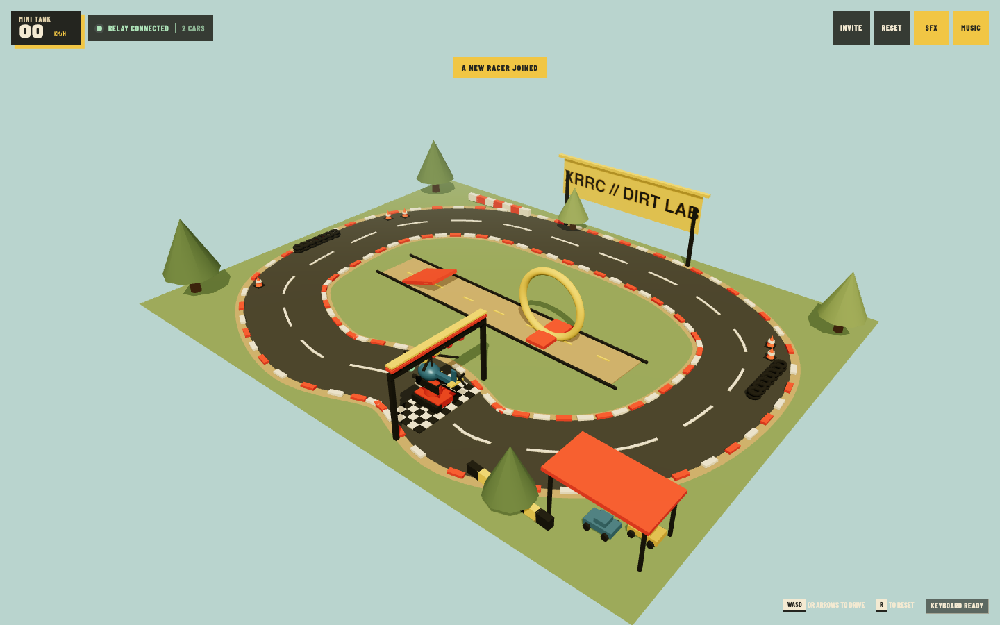

# XRRC Backyard Rally

[](https://github.com/mrhegemon/XRRC/actions/workflows/tests.yml)
[](https://github.com/mrhegemon/XRRC/actions/workflows/pages.yml)

XRRC is a static-first Three.js RC racing game for desktop, mobile, private
WebRTC multiplayer, native WebXR, and 8th Wall AR. Build a backyard course,
choose one of 13 vehicles, and race without an application backend. The
optional Node service only handles WebRTC signaling and is designed to stay
private behind Tailscale Serve.

**Play:** [lab.liambroza.com/XRRC](https://lab.liambroza.com/XRRC/)


## Highlights

- Responsive lobby and HUD with English, Spanish, and French localization.
- Seven handling classes plus six on-demand GLB rally-car skins.
- Spline-built asphalt circuit, shoulders, curbs, grid markings, scenery, and
  a separate jump-and-loop stunt lane.
- Keyboard, touch, standard Gamepad/XInput, and Quest-style XR controls.
- Synthesized engine, skid, impact, countdown, and music audio with impact
  vibration and controller rumble.
- Private-room WebRTC with origin-restricted signaling, health checks,
  reconnects, sequence validation, interpolation, and short-horizon prediction.
- A pit-pass invite dialog with a locally rendered QR code, copy, native share,
  email, text, and WhatsApp actions.
- Native immersive WebXR and an on-demand 8th Wall camera pipeline.
- A Quest quality profile and instanced track props that keep the reference
  scene within the automated render budget.
- 40 Node tests, 11 Playwright browser tests, CI, and deterministic screenshots.

## Visual gallery

### Vehicle classes

| Rally car | Dune buggy | 4x4 truck |
| --- | --- | --- |
|  |  |  |

| RC motorcycle | Mini tank | Prop plane |
| --- | --- | --- |
|  |  |  |

| Helicopter |
| --- |
|  |

### Localization, mobile, and multiplayer

| Spanish setup | Mobile setup | Mobile race |
| --- | --- | --- |
|  |  |  |

| Private relay setup | Tank peer | Helicopter peer |
| --- | --- | --- |
|  |  |  |

## Quick start

XRRC requires Node.js 18 or newer.

```bash
npm ci
npm start
```

Open <http://127.0.0.1:3000>. Local pages automatically use the bundled
signaling service; clear the multiplayer relay field or add `?signal=off` for a
solo race.

The browser imports Three.js and Google Fonts from their CDNs. The QR renderer
is fetched only when **Invite** is opened, and the 8th Wall packages are fetched
only when **Use 8th Wall** is selected.

## Player reference

### Start a heat

1. Choose a language, room code, vehicle, and optional course props.
2. Leave the relay blank for solo play, or enter and test a shared HTTPS
   Tailscale Serve URL for multiplayer.
3. Select **Start WebXR**, **Race on desktop**, or **Use 8th Wall**.
4. In AR, place the course on a detected surface. The countdown starts once the
   course is placed.

Jump, loop, and street-kit props can be enabled independently. The main spline
circuit remains available in every configuration.

### Vehicles

| Selection | Model | Handling |
| --- | --- | --- |
| Rally car | Procedural | Balanced baseline |
| Dune buggy | Procedural | Quick acceleration, tighter steering, lively bounce |
| 4x4 truck | Procedural | Lower speed, slower steering, heavier response |
| RC motorcycle | Procedural | Fastest ground vehicle with sharp steering |
| Mini tank | Procedural | Slow, stable, and able to pivot turn |
| Prop plane | Procedural | Fast air vehicle with wide steering |
| Helicopter | Procedural | Hovering air vehicle with agile pivot turns |
| Racer 1, Racer 2, Racer 3 | GLB skins | Rally physics |
| Taxi, Police, Coupe | GLB skins | Rally physics |

GLB models are loaded from `public/assets/cars/` only when needed. A procedural
rally body is shown until loading completes and remains as the fallback if an
asset cannot be loaded. Vehicle type is included in network state, so peers
render the same procedural model or skin.

The in-race bay renders a cached thumbnail for all 13 vehicles. Selecting an
empty slot summons that vehicle at its fixed pit stall and transfers control;
the previous vehicle remains parked where it stopped. Selecting a parked slot
recalls and disposes that vehicle. Selecting the active slot is a no-op.

### Controls

| Device | Drive | Steer | Reset |
| --- | --- | --- | --- |
| Keyboard | `W` / Up, `S` / Down | `A` / Left, `D` / Right | `R` |
| Touch | Drag joystick up/down | Drag joystick left/right | HUD **Reset** |
| Standard gamepad | Triggers, D-pad, face buttons, or left-stick Y | Left-stick X or D-pad | B or Menu |
| Quest-style XR | Right trigger forward, left trigger reverse, stick Y fallback | Left controller stick, then right | Right secondary face button |

Analog controls use a `0.14` deadzone. XR, keyboard, touch, and gamepad input
are mixed per axis in that priority order. Input is cleared when the browser
loses focus. Compatible gamepads receive dual-rumble feedback on resets and
impacts; mobile browsers may use `navigator.vibrate()` for impacts.

### Invite your pit crew

The HUD **Invite** button opens a keyboard-accessible pit pass with:

- a QR code generated locally in the browser;
- the complete room URL and one-tap copy feedback;
- the device's native share sheet when available;
- encoded email, text-message, and WhatsApp links.

The QR library is loaded on demand from jsDelivr, but the room URL is encoded on
the device and is not sent to a QR image service. Invite URLs preserve the room,
static-host subpath, relay, and any unrelated query parameters. Relay access
still determines who can join a private heat.

### Driving, collisions, and feedback

Each handling class defines its own acceleration, reverse speed, drag, steering,
bounce, ride height, and pivot-turn behavior. Ground vehicles produce dust and
skid effects; high throttle produces exhaust smoke; air vehicles hover, and
the helicopter produces rotor wash.

Vehicle footprints are measured from their rendered geometry. Rotated
rectangle collision tests separate overlapping local, parked, and remote
vehicles, then apply damped knockback. Track and vehicle impacts share particle,
audio, vibration, and gamepad-haptic feedback.

Music, sound effects, and their saved preferences are generated entirely with
the Web Audio API. The interface also honors `prefers-reduced-motion`.

## XR runtimes

| Mode | Runtime | Placement | Notes |
| --- | --- | --- | --- |
| Desktop/mobile 3D | Local Three.js renderer | Automatic | WebGL fallback and non-AR play |
| Native WebXR | Browser `immersive-ar` session | Hit-test reticle or automatic fallback | Requires a secure origin and browser/device support |
| 8th Wall | On-demand XR8 camera pipeline | Camera-runtime origin | Loads only after explicit selection |

### Native WebXR

XRRC requests:

- required `local-floor` reference space;
- optional `hit-test`, `dom-overlay`, and `hand-tracking`;
- a DOM overlay rooted at the game UI.

When hit testing is available, tap the reticle or use an XR controller select
action to place the course. If the browser grants the session without hit-test
support, the course is placed 2.3 meters in front of the viewer. The AR course
uses a `0.48` world scale.

### 8th Wall

Selecting 8th Wall loads the current engine binary, XRExtras, and landing-page
packages from jsDelivr, then registers:

- GL texture rendering;
- Three.js scene integration;
- XR controller support;
- landing, loading, full-window canvas, and runtime-error modules;
- the XRRC start/update pipeline.

No legacy 8th Wall app key is embedded in the repository. The engine binary is
subject to the
[Niantic Spatial XR Engine License](https://github.com/8thwall/engine/blob/main/LICENSE);
the companion packages retain their respective licenses.

### Quest quality profile

Quest Browser/Meta Quest user agents select this profile automatically. Use
`?quality=quest` to exercise it elsewhere.

| Setting | Standard | Quest |
| --- | ---: | ---: |
| Device pixel ratio | Up to 2 | 1 |
| Antialiasing | On | Off |
| Dynamic shadows | On | Off |
| Particle pool | 180 | 96 |
| XR framebuffer scale | 1.0 | 0.85 |
| XR foveation | 0 | 0.65 |

The runtime and controller contracts are covered with browser mocks. Final
72/90 Hz thermal and frame-pacing confirmation still requires physical Quest
hardware.

## Private multiplayer

XRRC uses the Node service for discovery only:

```text
GitHub Pages browser -- WSS --> Tailscale Serve --> 127.0.0.1:3000
         peer A <========== unordered WebRTC data channel ==========> peer B
```

1. Browsers connect to `/ws?room=<room>` and receive a random peer ID.
2. The signaling service relays validated `offer`, `answer`, and `ice` messages
   only within the normalized room.
3. Peers exchange game state directly over an unordered, zero-retransmit WebRTC
   data channel.
4. The active vehicle sends sequenced state every 50 ms. Receivers reject
   malformed or stale sequences, predict at most 120 ms ahead, and interpolate
   toward the result.
5. The WebSocket client reconnects with bounded exponential backoff. The server
   removes empty rooms and checks connections with a 30-second heartbeat.

Google STUN servers are configured, but no TURN relay is bundled. Networks that
cannot establish a direct WebRTC path need an external TURN configuration.
Rooms have no persistence or application-level authentication.

### Run signaling through Tailscale Serve

Start the service on its intentionally local-only default bind:

```bash
ALLOWED_ORIGINS=https://lab.liambroza.com \
HOST=127.0.0.1 \
PORT=3000 \
npm start

tailscale serve --bg 3000
tailscale serve status
```

Test the private endpoint from another device on the tailnet:

```bash
curl https://your-device.your-tailnet.ts.net/health
```

Enter `https://your-device.your-tailnet.ts.net` in the lobby relay field, or
share a configured URL:

```text
https://lab.liambroza.com/XRRC/?room=friday-night&signal=https%3A%2F%2Fyour-device.your-tailnet.ts.net
```

The client converts HTTPS to WSS, appends `/ws` when no path is supplied, and
adds the normalized room. Every browser in the heat must be able to reach the
same tailnet device. The origin allowlist is a browser-origin control, not user
authentication; keep Tailscale access restricted and avoid `ALLOWED_ORIGINS=*`.

### Signaling service safeguards

- Binds to `127.0.0.1` unless `HOST` is explicitly changed.
- Allows `https://lab.liambroza.com` and local browser origins by default.
- Applies the same origin policy to WebSocket upgrades and `/health`.
- Limits WebSocket payloads to 256 KiB.
- Relays only WebRTC offer, answer, and ICE message types.
- Normalizes room codes to lowercase URL-safe names of at most 32 characters.
- Exposes connection and room counts through a non-cacheable health response.

## Deployment and configuration

### GitHub Pages

`.github/workflows/pages.yml` deploys `public/` on every push to `main`. Enable
**Settings > Pages > Build and deployment > GitHub Actions** for the repository.
All local asset references are relative, so the app works from the `/XRRC/`
repository subpath without a build step.

Static Pages deployments run solo unless a signaling URL is supplied. To
preconfigure the private relay, create the Actions repository variable
`XRRC_SIGNAL_URL`:

```bash
gh variable set XRRC_SIGNAL_URL \
  --body "https://your-device.your-tailnet.ts.net"
```

The Pages workflow writes that value into `public/runtime-config.js` before
uploading the static artifact. A `signal` query parameter overrides deployment
configuration; `signal=off` or `signal=solo` explicitly disables multiplayer.

For another static host, publish `public/` and set its runtime configuration:

```js
window.XRRC_DEPLOYMENT = Object.freeze({
  siteUrl: 'https://example.com/xrrc/',
  signalUrl: 'https://your-device.your-tailnet.ts.net',
});
```

Update the canonical and Open Graph URLs in `public/index.html` when changing
the public site.

### Environment and deployment values

| Name | Default | Used by | Purpose |
| --- | --- | --- | --- |
| `HOST` | `127.0.0.1` | `server.js` | HTTP and WebSocket bind address |
| `PORT` | `3000` | `server.js` | HTTP and WebSocket port |
| `ALLOWED_ORIGINS` | `https://lab.liambroza.com` | `server.js` | Comma-separated browser origin allowlist |
| `XRRC_SIGNAL_URL` | Empty | Pages workflow | Build-time default relay URL |
| `XRRC_DEPLOYMENT.signalUrl` | Empty | Browser | Static runtime default relay URL |

### URL parameters

| Parameter | Example | Effect |
| --- | --- | --- |
| `room` | `friday-night` | Selects a normalized multiplayer room |
| `signal` | `https://device.tailnet.ts.net` | Overrides the relay; `off` and `solo` disable it |
| `vehicle` | `tank` | Preselects any procedural type or GLB skin ID |
| `lang` | `es` | Selects `en`, `es`, or `fr` |
| `quality` | `quest` | Forces the reduced-cost Quest profile |
| `controls` | `touch` | Forces the touch UI for testing |
| `mode` | `desktop` | Starts desktop mode automatically |
| `demo` | `drive` | Supplies deterministic driving input for captures |

Valid vehicle IDs are `rally`, `buggy`, `truck`, `motorcycle`, `tank`, `plane`,
`helicopter`, `toy-car-1`, `toy-car-2`, `toy-car-3`, `toy-car-taxi`,
`toy-car-cop`, and `car1`.

## Performance

Repeated road markers, curbs, start tiles, barriers, tires, lane markings, and
trees use `THREE.InstancedMesh` with static instance matrices. The particle
system uses one points geometry and updates typed arrays instead of creating
per-effect meshes.

The original batching pass reduced the 1440 x 900 procedural rally reference
from **363 to 74 draw calls** at **16,222 rendered triangles**. After integrating
the expanded vehicle system, the current reconciled scene measures **77 draw
calls** and **16,258 triangles**. Browser tests enforce a ceiling of 90 draw
calls and 90 geometries for every procedural vehicle class. GLB skin complexity
depends on the selected asset.

The in-race bay uses a separate 128 x 128 offscreen renderer. Thumbnails are
generated one at a time during idle windows so model parsing cannot delay the
first rendered frame or multiplayer handshake. Each result is cached as a data
URL and its temporary vehicle geometry is disposed.

Inspect the current frame from DevTools:

```js
window.XRRC_DIAGNOSTICS.snapshot()
```

The snapshot reports draw calls, triangles, points, geometries, textures,
object count, particle capacity, pixel ratio, XR scale, antialiasing, quality,
vehicle types, road normals, and shadow state.

## Architecture

| Path | Responsibility |
| --- | --- |
| `public/index.html` | Accessible lobby, runtime controls, HUD, and CDN imports |
| `public/css/style.css` | Responsive visual system, touch layout, and reduced-motion behavior |
| `public/js/game.js` | Three.js scene, track, vehicles, effects, XR integration, and UI orchestration |
| `public/js/game-core.js` | Deterministic handling, vehicle specs, network validation, and prediction |
| `public/js/controls.js` | Keyboard, pointer joystick, gamepad polling, and haptics |
| `public/js/controls-core.js` | Deadzones and device-independent control mappings |
| `public/js/network.js` | WebSocket signaling client and WebRTC peer data channels |
| `public/js/config.js` | Room, relay, health, and invite URL normalization |
| `public/js/share-core.js` | Email, text, and WhatsApp invite target encoding |
| `public/js/xr-core.js` | Native WebXR session and 8th Wall runtime contracts |
| `public/js/audio.js` | Procedural music, engine, skid, cue, and impact audio |
| `public/js/i18n.js` | English, Spanish, and French dictionaries and persistence |
| `public/runtime-config.js` | Static-host deployment values |
| `server.js` | Static local host, signaling relay, origin policy, and health endpoint |
| `test/` | Node unit and integration tests |
| `e2e/` | Playwright gameplay, mobile, XR, performance, and WebRTC tests |
| `scripts/capture-screenshots.js` | Deterministic desktop, mobile, vehicle, and two-peer captures |

The frontend has no bundler or compile step. Browser-safe core modules expose
small globals and also export through CommonJS so Node can test deterministic
logic without a DOM.

## Contributor workflow

Install exact dependencies and the Chromium browser used by Playwright:

```bash
npm ci
npx playwright install chromium
```

| Command | Purpose |
| --- | --- |
| `npm start` | Start the static app and signaling service |
| `npm run check:syntax` | Parse-check the server and browser JavaScript |
| `npm test` | Run 40 Node tests |
| `npm run check` | Run syntax checks and Node tests |
| `npm run test:e2e` | Run 11 Chromium browser tests |
| `npm run test:e2e:update` | Update Playwright snapshots if added later |
| `npm run screenshots` | Replace the deterministic gallery captures |

CI uses Node.js 22, installs Chromium with system dependencies, runs
`npm run check`, and then runs `npm run test:e2e`.

### Test coverage

- vehicle physics, bounds, drift, reset, prediction, and sequence rejection;
- keyboard, gamepad, XInput, touch, and Quest-style controller mappings;
- room and relay URL normalization;
- invite message encoding, accessible dialog structure, lazy QR rendering,
  clipboard/native share actions, direct share links, and mobile layout;
- origin-restricted health and signaling behavior plus room isolation;
- relative static assets, accessibility fallbacks, and Pages configuration;
- native WebXR and complete 8th Wall pipeline contracts;
- all seven procedural vehicle classes and render budgets;
- mobile localization, persisted language, and reachable touch controls;
- real two-browser WebRTC state exchange between different vehicle classes.

### Adding a vehicle

For a new handling class:

1. Add its immutable spec to `VEHICLE_SPECS` in `public/js/game-core.js`.
2. Add a procedural builder and dispatch entry in `Vehicle.setType()`.
3. Add the lobby option and localization keys.
4. Extend unit, browser, and screenshot coverage.

For a rally-physics GLB skin:

1. Add the asset under `public/assets/cars/`.
2. Add its ID and relative path to `GLB_SKINS`.
3. Add the matching lobby option and localization keys.
4. Verify loading fallback, thumbnail framing, selection deep links, disposal,
   and two-peer synchronization.

Keep deterministic logic in a core module when possible, preserve relative
asset URLs for GitHub Pages, and update both the runtime config and static tests
when changing the canonical deployment.
